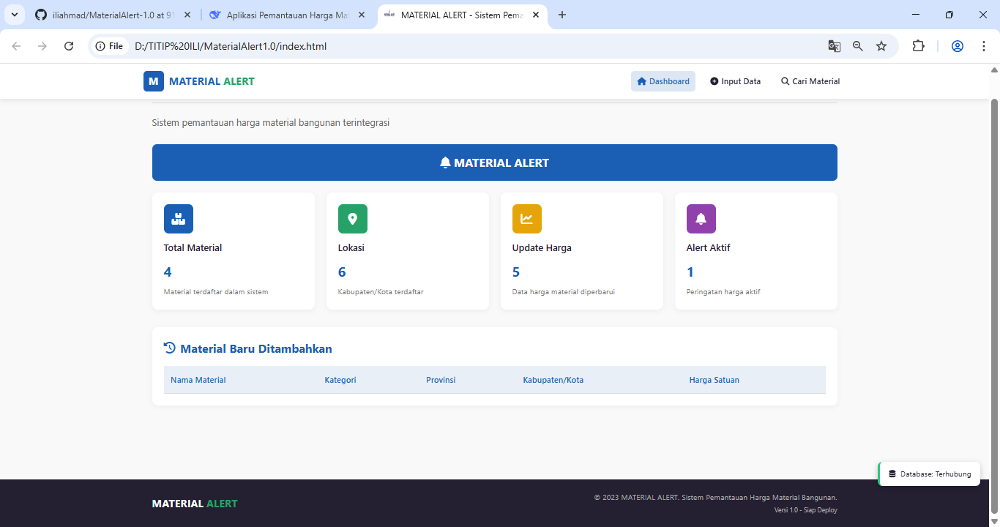
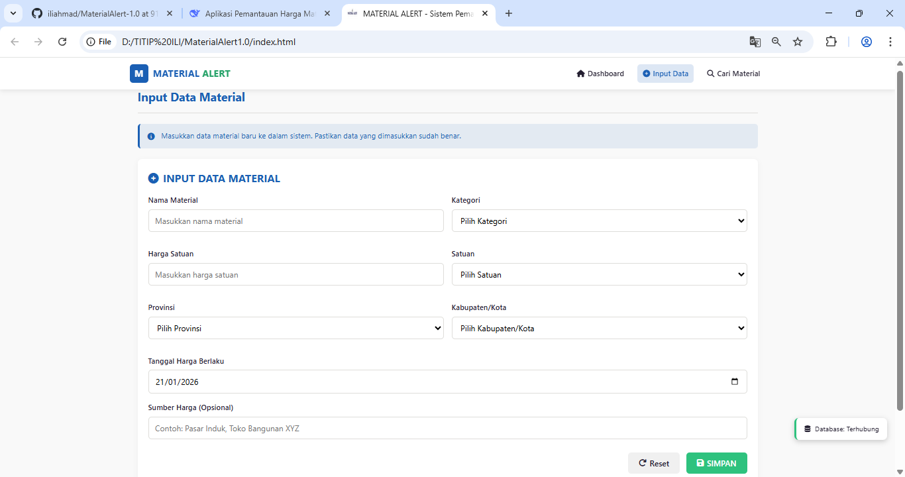
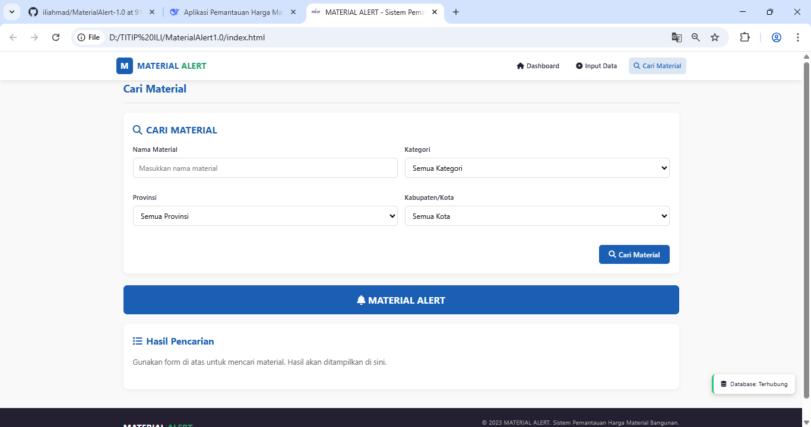

# MATERIAL ALERT

Sistem Pemantauan Harga Material Bangunan

🌐 **Live Demo:** [https://username.github.io/material-alert](https://username.github.io/material-alert)

## Fitur Utama
- Dashboard statistik material
- Input data material baru
- Pencarian material berdasarkan kriteria
- Database lokal dengan IndexedDB
- Responsive design untuk mobile dan desktop

## Teknologi
- HTML5, CSS3, JavaScript (ES6+)
- IndexedDB untuk penyimpanan data
- Font Awesome untuk ikon
- GitHub Pages untuk hosting

## Cara Menjalankan Lokal
1. Clone repository
```bash
git clone https://github.com/username/material-alert.git
# MATERIAL ALERT

## Screenshots

### Dashboard


### Input Data


### Hasil Pencarian
